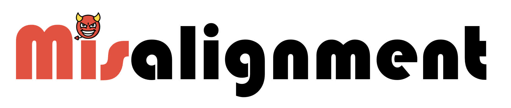

# Safety Misalignment Against Large Language Models

[](https://doi.org/10.5281/zenodo.14249424)

[](.)

This repository contains the official code for the paper "Safety Misalignment Against Large Language Models", accepted by NDSS 2025.

## Hardware & Software dependencies
To run the code, ensure you have the following requirements:
- Disk space: 70 GB
- RAM: 64 GB (Ours: 256 GB)
- GPU: 1 NVIDIA GPU with at least 48 GB of VRAM (Ours: NVIDIA A800 with 80 GB of VRAM)
- OS: Modern x86_64 Linux with `git`, `curl`, `sha256sum`, and `bash`. (Ours: Ubuntu 22.04.3, Kernel 6.8.0-40-x86_64, bash 5.1.16)
- NIVIDA Drivers: 525.60.13+ to support CUDA 12.x. (Ours: 535.104.05)
- Python: >=3.10, <=3.12.6, with `pip` installed and support for virtual environments (`conda` or `venv`) (Ours: 3.11.9 installed via Miniconda 23.5.2)

## Installation & Configuration
### Retrive the artifact
Our artifact is available at https://github.com/ThuCCSLab/misalignment.
This repository also references a modified version of LitGPT (https://github.com/ThuCCSLab/litgpt-misalignment) as a git submodule in the `litgpt` folder.

All these artifacts can be downloaded using:
```
git clone --recursive https://github.com/ThuCCSLab/misalignment.git
```

Alternatively, you can download the stable version of our artifact from either the [GitHub Release](https://github.com/ThuCCSLab/misalignment/releases/latest) or [Zenodo](https://doi.org/10.5281/zenodo.14249424).

### Setup Python Virtual Environments
This artifact requires two Python environments, each with a different set of packages installed.

The primary environment (`misali`) is used in most cases. Set it up via `conda` with:
```bash
conda create -n misali python=3.12.6 -y &&
conda activate misali &&
pip install -r requirements.txt 
```

The secondary environment (`misali-lit`) is used for experiments involving LoRA Adapters. Set it up via `conda` with:
```bash
conda create -n misali-lit python=3.12.6 -y &&
conda activate misali-lit &&
pip install -e litgpt[all]
```

### Prepare Models
This artifact requires two models in the `models` folder: The target model `meta-llama/Llama-2-7b-chat-hf` (26 GB disk space) and the harmfulness evaluation model `cais/HarmBench-Llama-2-13b-cls` (25 GB disk space).

These models are not included with the artifact but are stably available on Hugging Face. To download them, activate the `misali-lit` environment and execute the following commands:
```bash
huggingface-cli login # Llama requires authorization
huggingface-cli download meta-llama/Llama-2-7b-chat-hf --revision f5db02db724555f92da89c216ac04704f23d4590 --local-dir models/meta-llama/Llama-2-7b-chat-hf
huggingface-cli download cais/HarmBench-Llama-2-13b-cls --revision bda705349d1144fa618770bea64d99ce54e3835b --local-dir models/cais/HarmBench-Llama-2-13b-cls
```

The `meta-llama/Llama-2-7b-chat-hf` model should be further converted to the LitGPT format, using another 13GB disk space and 2 minutes:
```bash
litgpt convert to_litgpt  --checkpoint_dir models/meta-llama/Llama-2-7b-chat-hf
```

### Prepare Datasets
Some datasets required for model training and evaluation are not included with the artifact but are stably available elsewhere. Execute `./download.sh` to download and verify these datasets into the `data` folder. This process consumes approximately 1 minute and 1MB disk space.

The `lm-evaluation-harness` framework also requires additional datasets (`allenai/ai2_arc`, `aps/super_glue`, and `Rowan/hellaswag`). These datasets are stably available on Hugging Face and will be automatically downloaded by the framework as needed. The one-time download consumes approximately 5 minutes and 250MB disk space.

### Update Configurations
- If the models are stored in a different path, update the corresponding fields of the YAML files in the `configs` folder and Line 28 of the `run.sh` file.
- If you use a virtual environment provider other than conda or have different environment namings, modify Lines 44-56 of the `run.sh` file to activate your environments appropriately.
- Adjust the training precision and batch sizes in Lines 34-36 based on your VRAM capacity. For example, if you only have 48GB of VRAM instead of 80GB, use the settings in Lines 39-41 instead of those in Lines 34-36.
- All experiments use a single GPU. If you have multiple GPUs, you can specify which one to use by setting the `CUDA_VISIBLE_DEVICES` environment variable. For example, to use GPU 1 in the current bash, you can run `export CUDA_VISIBLE_DEVICES=1`.

## Experiment Workflow
The evaluation process consists of three main stages:
1. Break the target model's safety guardrail using various methods:
    1. Modify system prompts. (`src/infer_harm.py`)
    2. Fine-tune the model using LoRA, AdaLoRA, IA3, and Prompt Tuning with the PEFT library. (`src/finetune.py`)
    3. Fine-tune the model using LoRA Adapter V1 and V2 with the LitGPT library. (`litgpt finetune` command)
    4. Fine-tune the model using our SSRA method. (`src/ssra.py`)
2. Apply our SSRD defense to realign the target model (`src/ssrd.py`).
3. Assess the harmfulness (`src/infer_harm.py`, `litgpt` `generate` commands, `src/eval_harm.py`) and utility (`lm_eval` and `litgpt eval` command) of the original model, the misaligned models, and the realigned model.

Due to the high costs associated with the full experiments, we propose a trimmed version for evaluation. Specifically, we adopt the most widely used model `meta-llama/Llama-2-7b-chat-hf` as the sole target model and use the HS-10 dataset, which contains only 10 records but is highly effective, as the only dataset for fine-tuning. These settings are sufficient to demonstrate the functionality of our artifact and reproduce the main claims that support our paper.

## Major Claims
- (C1): The Llama model exhibits good safety alignment while maintaining high performance. (E1, Table IV) 
- (C2): Adversarial system prompts can not compromise the safety alignment of Llama. (E2, Table V)
- (C3): Fine-tuning with appropriate methods and datasets can break the safety alignment of Llama while preserving its utility. Specifically, LoRA and AdaLoRA are the most effective methods. (E3, Table VII and XVI)
- (C4): Our SSRA method can also break the safety alignment of Llama while maintaining its utility, achieving effectiveness comparable to the fine-tuning approach.  (E4, Section VII.D)
- (C5): Our SSRD method can realign the safety of Llama while preserving its utility. (E5, Table XIII)

## Experiment Metrics
Our artifact evaluates the _harmfulness_ and _utility_ of the LLMs, following Section VI.B of our paper.

For harmfulness evaluation, we use a dataset of harmful questions (StrongReject-small) located at `data/evaluation/strongreject`. We also include its full version (StrongReject) for reference. The benchmark involves querying the model with these questions and automatically evaluating harmfulness using the safety evaluator `HarmBench-Llama-2-13b-cls`. The benchmark reports the Attack Success Ratio (ASR), defined as the ratio of harmful questions answered.

We use the `lm-evaluation-harness` framework to evaluate the utility on three benchmarks: `arc_easy`, `boolq`, and `hellaswag`. Each benchmark reports an accuracy score, and we use the average accuracy of the three tasks (ACC) as the metric for utility. Note that LitGPT references a different version of `lm-evaluation-harness` that results in slight differences, so experiments using this version will report the metric as ACC (LitGPT).

## Evaluation
### Experiment (E1)
__[2 human-minutes, 10 GPU-minutes, 5 network-minutes for the first run]__  
Evaluate the safety and utility of Llama as a baseline. 

__[Preparation]__  
Follow the instructions in the "Installation & Configuration" section.

__[Execution]__  
Simply run the command `./run.sh E1`.

__[Results]__  
Results are saved in the `results/E1` folder. The evaluated ASR, ACC, and ACC (LitGPT) are also output to the console. These results generally align with the Llama row of Table IV. This indicates that Llama has good safety alignment and performance.

### Experiment (E2)
__[3 human-minutes, 15 GPU-minutes]__  
Attempt to break the safety guardrail of Llama by modifying system prompts, then evaluate the corresponding model harmfulness.

__[Preparation]__  
Ensure that Experiment (E1) has been run.

__[Execution]__   
Run `./run.sh E2 all` for the full set, or execute one of the following commands for a quick tour:
```bash
./run.sh E2 A # Default SP
./run.sh E2 B # HEDA
./run.sh E2 C # DT
./run.sh E2 D # AOA
```

__[Results]__  
Results are saved in the `results/E2` folder. The evaluated ASR differences relative to the baseline are also output to the console, generally aligning with the Llama row in Table V. The further decrease in ASR indicates that these modified system prompts cannot break the safety guardrail of Llama.
### Experiment (E3)
__[5 human-minutes, 40 GPU-minutes]__  
Break the safety guardrail of the target model by different fine-tuning methods, then evaluate the safety and utility of the resulting models.

__[Preparation]__  
Ensure that Experiment (E1) has been run.

__[Execution]__   
Run `./run.sh E3 all` for the full set, or execute one of the following commands for a quick tour:
```bash
./run.sh E3 A # LORA
./run.sh E3 B # ADALORA
./run.sh E3 C # IA3
./run.sh E3 D # Prompt Tuning
./run.sh E3 E # LoRA Adapter V1
./run.sh E3 F # LoRA Adapter V2
```

__[Results]__  
The fine-tuned models and the evaluated results are saved in the `results/E3` folder. The evaluated ASR and ACC differences relative to the baseline are also output to the console, generally aligning with the (Llama, HS-10) row in Table VII and XVI. Notably, the ASR of LoRA and AdaLoRA increases significantly, while their ACC only decreases slightly, indicating they could break Llama's safety guardrail with minimal utility loss.

### Experiment (E4)
__[2 human-minutes, 5 GPU-minutes]__  
Break the safety guardrail of Llama using our SSRA method with $|E_-| = 30$ and $|E_+| = 60$, then evaluate the safety and utility of the resulting models.

__[Preparation]__  
Ensure that Experiment (E3) has been run.

__[Execution]__  
Simply run the command `./run.sh E4`.

__[Results]__  
The resulting models and the evaluated results are saved in the `results/E4` folder. The evaluated ASR and ACC are also output to the console, generally aligning with the claim in Section VII.D that the ASR is 83.3% and the ACC is 67.4%. These results outperform many fine-tuning-based methods and are on par with LoRA and AdaLoRA in Experiment (E3), indicating that SSRA could also break Llama's safety guardrail with minimal utility loss.
### Experiment (E5)
__[2 human-minutes, 5 GPU-minutes]__  
Realign the safety of the misaligned model using our SSRD methods, then evaluate the safety and utility of the resulting models.

__[Preparation]__  
Ensure that the LoRA part of Experiment (E3) has been run.

__[Execution]__  
Simply run the command `./run.sh E5`.

__[Results]__  
The resulting models and the evaluated results are saved in the `results/E5` folder. The evaluated ASR and ACC differences relative to the baseline are also output to the console, generally aligning with the (Llama, LoRA (HS-10)) row in Table XIII. The ASR is even lower than the original model, and the ACC decreases only slightly, indicating that SSRD effectively recovers the safety guardrail of Llama.
## Notice
This AEC-reviewed artifact corresponds to a previous version of our paper, where E2 does not report ACC and E5 does not report ACC-G.

## Acknowledgements
We extend our sincere gratitude to these authors whose work has been instrumental to this artifact:
### Datasets
- **SA**: Shadow Alignment: The Ease of Subverting Safely-Aligned Language Models by Xianjun Yang, Xiao Wang, Qi Zhang, Linda Petzold, William Yang Wang, Xun Zhao, Dahua Lin (arXiv:2310.02949)
- **HS**: Exploiting Novel GPT-4 APIs by Kellin Pelrine, Mohammad Taufeeque, Michał Zając, Euan McLean, Adam Gleave (arXiv:2312.14302)
- **AOA**: Fine-tuning Aligned Language Models Compromises Safety, Even When Users Do Not Intend To! by Xiangyu Qi, Yi Zeng, Tinghao Xie, Pin-Yu Chen, Ruoxi Jia, Prateek Mittal, Peter Henderson (arXiv:2310.03693)
- **SafeBench**: FigStep: Jailbreaking Large Vision-language Models via Typographic Visual Prompts by Yichen Gong, Delong Ran, Jinyuan Liu, Conglei Wang, Tianshuo Cong, Anyu Wang, Sisi Duan, Xiaoyun Wang (arXiv:2311.05608)
- **StrongReject**: A StrongREJECT for Empty Jailbreaks by Alexandra Souly, Qingyuan Lu, Dillon Bowen, Tu Trinh, Elvis Hsieh, Sana Pandey, Pieter Abbeel, Justin Svegliato, Scott Emmons, Olivia Watkins, Sam Toyer (arXiv:2402.10260)
### Models
- **Harmfulness evaluation**: Harmbench: A Standardized Evaluation Framework for Automated Red Teaming and Robust Refusal by Mantas Mazeika, Long Phan, Xuwang Yin, Andy Zou, Zifan Wang, Norman Mu, Elham Sakhaee, Nathaniel Li, Steven Basart, Bo Li, David Forsyth, Dan Hendrycks (arXiv:2402.04249).
### Prompts
- **System prompt HEDA** Fine-tuning Aligned Language Models Compromises Safety, Even When Users Do Not Intend To! by Xiangyu Qi, Yi Zeng, Tinghao Xie, Pin-Yu Chen, Ruoxi Jia, Prateek Mittal, Peter Henderson (arXiv:2310.03693)
- **System prompt SPAOA** Fine-tuning Aligned Language Models Compromises Safety, Even When Users Do Not Intend To! by Xiangyu Qi, Yi Zeng, Tinghao Xie, Pin-Yu Chen, Ruoxi Jia, Prateek Mittal, Peter Henderson (arXiv:2310.03693)
- **System prompt DT** DecodingTrust: A Comprehensive Assessment of Trustworthiness in GPT Models by Boxin Wang, Weixin Chen, Hengzhi Pei, Chulin Xie, Mintong Kang, Chenhui Zhang, Chejian Xu, Zidi Xiong, Ritik Dutta, Rylan Schaeffer, Sang T. Truong, Simran Arora, Mantas Mazeika, Dan Hendrycks, Zinan Lin, Yu Cheng, Sanmi Koyejo, Dawn Song, Bo Li (arXiv:2306.11698)
- **Harmfulness evaluation prompt**: Harmbench: A Standardized Evaluation Framework for Automated Red Teaming and Robust Refusal by Mantas Mazeika, Long Phan, Xuwang Yin, Andy Zou, Zifan Wang, Norman Mu, Elham Sakhaee, Nathaniel Li, Steven Basart, Bo Li, David Forsyth, Dan Hendrycks (arXiv:2402.04249).
### Codes
- **PEFT**: https://github.com/huggingface/peft by Sourab Mangrulkar, Sylvain Gugger, Lysandre Debut, Younes Belkada, Sayak Paul, and Benjamin Bossan.
- **LitGPT**: https://github.com/Lightning-AI/litgpt by Lightning AI.

## Copyright Notice
This artifact is licensed under the MIT License. Please refer to the LICENSE file for details.

The distribution of this artifact also includes materials created by or derived from others, with their licenses placed under the corresponding folders or code pieces.